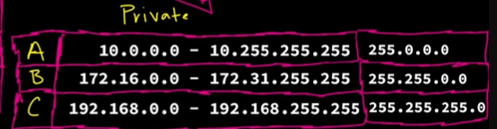

# Private IP Addresses

Originally, we had a total of about **4.3 billion IPv4 addresses**. To be exact:

2^32=4,294,967,296

We ran into a problem because the internet’s original designers didn’t account for the massive growth of devices. In fact, we eventually **ran out of IPv4 addresses**. But we came up with a workaround.

---

## RFC 1918 – Private IP Addresses

One “band-aid” solution is **RFC 1918**, which defines **private IP addresses**. Essentially, we took chunks of the IP address space and reserved them for private networks. These ranges are categorized as **Class A, B, and C**, like in the following image:

Private IP addresses **cannot be directly accessed from the public internet**—they are **not publicly routable**.

---

## NAT – Network Address Translation

Another brand Aid is **NAT (Network Address Translation)**.

For example, your home router assigns **private IP addresses** to all your devices. These private addresses might even be the same as devices in another part of the world. But your router only has **one public IP address** provided by your ISP (e.g., ATT).

When your device wants to access `youtube.com`, it doesn’t use its private IP directly. Instead, **NAT automatically translates your device’s private IP into your router’s public IP**, allowing communication with YouTube. From the outside, all your devices share the **single public IP address** assigned by your ISP.

---

## IPv6 – The Future

Even with private IP addresses and NAT, **IPv4 addresses are still running out**. That’s why we now use **IPv6**, which uses **128-bit addresses**, for example:
 
`2001:0db8:85a3:0000:0000:8a2e:0370:7334`

IPv6 provides a vastly larger pool of unique IP addresses (about **340 undecillion**) and is designed to eventually replace IPv4.
