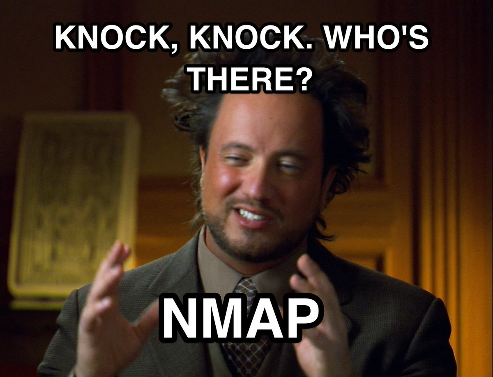

# Network Mapper (Nmap)

---

## OverView

Nmap is a network scanning tool that answers:

- Is the host alive or dead?
- What ports are open or listening?
- What services are running on those ports?
- what Os is the host running?
- what version of software is it running?

> like a spy sent to map which tunnels are open -
>
> some spies are stealthy, some get captured
> (Completing the full handshake)

# Nmap Memes

<div align="center">


<br><br>




</div>

## How nmap works

Nmap sends specially crafted packets to target ports and analyzes the responses. Based on response or silence it determines port state.

```bash
Nmap sends packet
        ↓
Port responds  → open, closed or unfiltered
Port silent    → filtered (firewall blocking)
Port resets    → closed (nothing listening)
```

---

## Port States

| State              | Meaning                                          |
| ------------------ | ------------------------------------------------ |
| **open**           | Host alive, service actively listening           |
| **closed**         | Host alive, reachable but nothing listening      |
| **filtered**       | Firewall blocking — can't tell if open or closed |
| **open\|filtered** | Nmap cannot determine if open or filtered        |
| **unfiltered**     | Port accessible but state unknown                |

> Filtered is most frustrating for attacker
> — firewall hiding everything behind it.

---

## Scan Types

### -sS — SYN Scan (Stealth/Half Open)

Most commonly used scan.

```
Nmap sends SYN
        ↓
Target sends SYN-ACK → port open
        ↓
Nmap sends RST instead of ACK
Never completes full handshake
```

Why stealthy:

- Never completes TCP handshake
- Not logged by many older systems
- Faster than full connect scan
- Requires root privileges

---

### -sT — Connect Scan (Full TCP)

```
SYN → SYN-ACK → ACK
Full handshake completed
```

- More detectable — logged by most systems
- Used when SYN scan not available
- Does NOT require root privileges

---

### -sU — UDP Scan

- Slower than TCP scans
- Critical for finding:

| Port  | Service |
| ----- | ------- |
| 53    | DNS     |
| 161   | SNMP    |
| 67/68 | DHCP    |

---

## Important Flags

| Flag       | Purpose                                          |
| ---------- | ------------------------------------------------ |
| **-sS**    | SYN stealth scan                                 |
| **-sT**    | Full TCP connect scan                            |
| **-sU**    | UDP scan                                         |
| **-sV**    | Version detection                                |
| **-sC**    | Default script scan                              |
| **-O**     | OS detection (requires root)                     |
| **-A**     | Aggressive — OS + version + scripts + traceroute |
| **-p**     | Specify ports (-p 80 or -p 1-1000)               |
| **-p-**    | Scan ALL 65535 ports                             |
| **-Pn**    | Skip host discovery                              |
| **--open** | Show only open ports                             |
| **-oN**    | Save output to file                              |
| **-v**     | Verbose output                                   |

---

## Timing Templates

| Flag    | Name       | Use Case                 |
| ------- | ---------- | ------------------------ |
| **-T0** | Paranoid   | Very slow, very stealthy |
| **-T1** | Sneaky     | Slow, stealthy           |
| **-T2** | Polite     | Slower, less bandwidth   |
| **-T3** | Normal     | Default                  |
| **-T4** | Aggressive | Faster — use in HTB      |
| **-T5** | Insane     | Very fast, very loud     |

---

## Nmap Scan Phases

```
Phase 1 → Host Discovery
          is target alive?

Phase 2 → Port Scanning
          what ports are open?

Phase 3 → Service Detection (-sV)
          what is running on open ports?

Phase 4 → OS Detection (-O)
          what OS is target running?

Phase 5 → Script Scanning (-sC)
          automated checks and enumeration
```

---

## NSE — Nmap Scripting Engine

Scripts that automate tasks during scanning.

| Category    | Purpose                   |
| ----------- | ------------------------- |
| **safe**    | Safe to run always        |
| **default** | Run with -sC flag         |
| **vuln**    | Check for vulnerabilities |
| **exploit** | Attempt exploitation      |
| **brute**   | Brute force credentials   |

### Reading Script Output

```bash
| script-name: result
|   more details
|_  last line of output

| = more output coming
|_ = last line of this result
```

---

## Real Scan Example — scanme.nmap.org

```bash
nmap -A scanme.nmap.org
```

Discovered:

```
IP       = 45.33.32.156
OS       = Ubuntu Linux
Location = ~19 hops away (United States)
Route    = through Google backbone (8.8.8.8)

Open Ports:
22/tcp  → OpenSSH 6.6.1p1 (old version)
80/tcp  → Apache httpd 2.4.7 (old version)
9929/tcp → Nping echo
31337/tcp → "elite" — hacker culture easter egg
```

> 31337 = "eleet" in leetspeak
> historically associated with hacking culture

---

## Cybersecurity Use

### Attacker Workflow

```
nmap → find alive hosts
     → find open ports
     → identify service versions
     → search for vulnerabilities
     → exploit found weaknesses
```

### Defender Workflow

```
nmap own network regularly
     → find unexpected open ports
     → find misconfigured services
     → fix before attacker finds them
```

### Common HTB Workflow

```
# Quick scan first
nmap -T4 <target>

# Then full scan
sudo nmap -A -p- <target>

# Save output
sudo nmap -A -p- -oN scan.txt <target>
```

---

## One Line Summary

```
Nmap   = spy that maps which tunnels are open
-sS    = stealthy spy (never caught)
-sT    = obvious spy (gets logged)
-A     = full intelligence gathering
Versions found = research exploits for those versions
```
